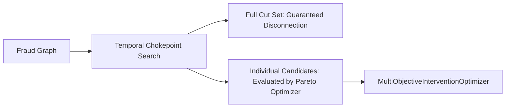

# Temporal Min-Cut & Chokepoint Search Subsystem

## Overview

The **Temporal Chokepoint Search** subsystem represents Stage 6 of the AEGIS-Flow analytical pipeline:

> **Stage 6**: Capacity-aware chokepoint search that identifies intervention locations capable of separating suspected fraud sources from specified cash-out destinations.

This subsystem formulates the challenge of cutting off illicit fund dissipation as a deterministic minimum-cost $s-t$ cut problem over a sparse time-expanded causal network. It minimizes legitimate financial collateral disruption while strictly guaranteeing that every modeled time-respecting path between designated fraud sources and cash-out sinks is severed.

---

## 1. What is a Temporal Cut?

In static graph theory, an $s-t$ cut is a partition of vertices $(S, T)$ with $s \in S$ and $t \in T$, where the cut edges are directed edges from $S$ to $T$. Removing these edges severs all directed paths from $s$ to $t$.

However, financial flows are **temporal**:
```text
Fraud Source
     ↓
Transaction at t1
     ↓
Transaction at t2
     ↓
Transaction at t3
     ↓
Cash-Out Destination

where t1 < t2 < t3
```

A **temporal cut** is a subset of transaction events whose removal disconnects all **time-respecting** paths from the source accounts to the destination accounts.

### Why Ordinary Static Graph Cuts Fail on Temporal Flows

Applying a static min-cut directly to a static account graph admits **temporally invalid paths**. For instance:

1. **Retrograde Flow**: Account $B$ receives money from $A$ at $t = 12:00$, but transferred money to $C$ at $t = 09:00$. A static graph sees a path $A \to B \to C$, whereas in reality money cannot travel backwards in time.
2. **False Chokepoints**: A static cut algorithm may recommend severing an edge that occurred prior to fund arrival or an edge that cannot causally carry tainted proceeds.
3. **Simultaneous Settlements**: Under AEGIS-Flow's MVP causality rule, two transactions occurring at the exact same timestamp ($t_1 = t_2$) are not causally linked ($t_{next} > t_{curr}$ strictly). Static graphs cannot distinguish simultaneous events from ordered sequences.

---

## 2. Sparse Time-Expanded Network Construction

To guarantee temporal correctness without materializing an intractable Cartesian product ($|V| \times |T|$), AEGIS-Flow constructs a sparse, event-driven time-expanded network:

### Graph Entities & Topology

1. **Global Source & Sink**:
   - `SOURCE` (Node 0): Connected to $e_{in}$ for all transactions departing designated source accounts with capacity $\infty$.
   - `SINK` (Node 1): Connected from $e_{out}$ for all transactions arriving at designated sink accounts with capacity $\infty$.

2. **Event Splitting**:
   - Every active transaction $e$ is split into an input vertex $e_{in}$ and an output vertex $e_{out}$.
   - The directed arc $e_{in} \to e_{out}$ carries capacity:
     $$\text{capacity}(e) = \begin{cases} \text{encoded\_cost}(e) & \text{if } e \text{ is eligible for intervention} \\ \infty & \text{if } e \text{ is ineligible (historical, locked, or excluded)} \end{cases}$$

3. **Account Timelines**:
   - For each account $v$, collect all distinct timestamps $\tau_1 < \tau_2 < \dots < \tau_m$ among incident transactions.
   - For each timestamp $\tau_k$, instantiate a timeline node $(v, \tau_k)$, representing funds available at $v$ strictly after $\tau_k$.
   - **Waiting Arcs**: $(v, \tau_k) \to (v, \tau_{k+1})$ with capacity $\infty$ model unspent capital carried forward.
   - **Inflow Arcs**: An incoming event arriving at $\tau_k$ connects $e_{out} \to (v, \tau_k)$ with capacity $\infty$.
   - **Outflow Arcs**: An outgoing event departing at $\tau_k$ requires funds that arrived strictly before $\tau_k$. Hence it is fed by $(v, \tau_{k-1}) \to e_{in}$ with capacity $\infty$. If $k = 1$, no earlier incoming transfer exists at account $v$.

### Mathematical Invariants
- **Acyclicity**: Every edge step or timeline arc strictly advances physical time. The resulting flow network is a Directed Acyclic Graph (DAG).
- **Linear Complexity**: For $E$ active events, total vertices $|V| \le 4E + 2$ and total arcs $|A| \le 7E$. Network size scales strictly as $O(E)$, avoiding large memory footprints.

---

## 3. Intervention Cost Encoding

The objective of the chokepoint search is to isolate fraud while minimizing legitimate disruption. We use a **lexicographic integer encoding**:

Let $N$ be the total number of eligible cuttable transaction edges. For an eligible edge $e$:
$$\text{encoded\_cost}(e) = \text{collateral\_minor\_units}(e) \times (N + 1) + 1$$

### Mathematical Properties
1. **Primary Objective (Collateral Minimization)**:
   For any two cuts $C_1$ and $C_2$, if $\text{collateral}(C_1) < \text{collateral}(C_2)$, then:
   $$\text{cost}(C_2) - \text{cost}(C_1) \ge (N + 1) - (N - 1) = 2 > 0$$
   A cut with lower legitimate disruption is strictly preferred over any cut with higher disruption, regardless of edge counts.
2. **Secondary Objective (Cut Size Minimization)**:
   If two cuts have identical collateral, the difference in encoded cost equals $|C_2| - |C_1|$. The cut with fewer held edges is selected.
3. **Zero-Collateral Handling**:
   When an edge carries zero legitimate collateral, its encoded cost is $0 \times (N + 1) + 1 = 1$. It remains cuttable with minimal finite capacity.
4. **Infinite Capacity Derivation**:
   To ensure structural and ineligible edges cannot be severed:
   $$\text{INF\_CAPACITY} = \sum_{e \in \text{eligible}} \text{encoded\_cost}(e) + 1$$
   Cutting even a single structural edge costs more than cutting all eligible edges combined.

---

## 4. Minimum-Cut Solution via Dinic's Algorithm

AEGIS-Flow uses a self-contained, deterministic implementation of **Dinic's Algorithm**:
1. **Level Graph (BFS)**: Computes vertex levels from `SOURCE` in the residual network.
2. **Blocking Flow (DFS)**: Pushes flow along level graph arcs with current-arc pointer optimization.
3. **Min-Cut Extraction**: Computes the set $S^*$ of vertices reachable from `SOURCE` in the residual network. Any forward arc $(u, v)$ with $u \in S^*$ and $v \notin S^*$ is in the minimum cut.
4. **Determinism**: Arcs are evaluated in canonical order sorted by `(occurred_at, event_id)`. The reachable set $S^*$ produces the unique canonical source-closest minimum cut.

### Feasibility States
- `OPTIMAL_CUT_FOUND`: Max-flow $> 0$ and $< \text{INF\_CAPACITY}$. A valid set of eligible edges disconnects all paths.
- `NO_PATH_EXISTS`: Max-flow $= 0$. Sources and sinks are already disconnected; cut size is 0.
- `NO_FEASIBLE_CUT`: Max-flow $\ge \text{INF\_CAPACITY}$. All paths traverse at least one ineligible or historical edge; no policy-compliant cut exists.
- `INVALID_INPUT`: Sources or sinks are missing, or source and sink accounts overlap.
- `BUDGET_EXCEEDED`: Active events, vertices, or arcs exceed configured safety limits.

---

## 5. Estimating Legitimate Collateral

Legitimate collateral is estimated per eligible candidate edge by querying the authoritative `CounterfactualSimulator`:
```python
candidate = InterventionCandidate(
    intervention_type=InterventionType.EDGE_HOLD,
    target_event_id=edge.event_id,
)
res = simulator.simulate(candidate, simulation_timestamp)
collateral = res.modeled_legitimate_capital_affected
```
This reuses existing taint mechanics without duplicating allocation or running competing ledgers.

> [!IMPORTANT]
> **Additive Cost Approximation**: The encoded cut cost sums individual single-edge counterfactual estimates. When multiple edges are held simultaneously, non-linear interactions (e.g. downstream flows diverted by an earlier hold) can cause the combined collateral to differ from the sum of individual estimates.

---

## 6. Full Cut Set vs. Individual Intervention Candidates

The chokepoint subsystem outputs two distinct representations:
1. **Complete Cut Set (`cut_edges`)**:
   The complete set of edges that, if held simultaneously, mathematically disconnects all modeled source-to-sink paths.
2. **Individual Candidates (`candidates`)**:
   Each cut member converted into an `InterventionCandidate(intervention_type=EDGE_HOLD, target_event_id=...)`.



Under AEGIS-Flow's current single-intervention policy (`maximum_interventions = 1`), individual candidates are fed to `MultiObjectiveInterventionOptimizer`. Holding a single edge of a multi-edge cut does not guarantee full path disconnection; multi-intervention bundle execution is reserved for future joint planner extensions.

---

## 7. Forecast-Aware Integration & Leakage Prevention

1. **Historical Immutability**:
   Events occurring at $t \le T$ (where $T$ is `simulation_timestamp`) are assigned infinite capacity. They cannot be held to reverse settled flow.
2. **No Future Ground-Truth Leakage**:
   Only events explicitly known at decision time $T$ (or generated within hypothetical forecast worlds) are ingested. Future ground-truth events after $T$ cannot influence candidate selection.
3. **Forecast Event Boundary**:
   Hypothetical edges (`ForecastTransactionEvent`) are tagged with `is_forecast = True` and evaluated strictly in-memory. They are never written to canonical transaction storage. When evaluated across multiple forecast scenarios, chokepoint candidate generation runs independently per scenario world.

---

## 8. Bounded Computation & Complexity

- **Input Limit**: Configurable `max_active_events` (default: 10,000).
- **Network Limits**: `max_expanded_vertices` (default: 50,000) and `max_expanded_arcs` (default: 100,000).
- **Time Complexity**:
  - Construction: $O(E \log E)$ to sort event timestamps.
  - Dinic's Algorithm on DAG: $O(V \cdot E) \approx O(E^2)$ worst-case, running in $O(E \sqrt{V}) \approx O(E^{1.5})$ in typical sparse networks.
  - Verification: $O(V + E)$ residual BFS reachability.
  - Practical Runtime: ~1–3 ms on standard synthetic scenarios.

---

## 9. Known Limitations

1. **Additive Cost Assumption**: Does not simulate joint multi-hold commingling dynamics during cut search.
2. **Single-Action Policy Execution**: Downstream execution selects a single intervention rather than executing the entire cut set as an atomic bundle.
3. **Finite Horizon**: Paths that cash out after the modeled graph horizon or via unobserved channels are outside the search scope.
4. **MVP Timestamp Causality**: Simultaneous events ($t_1 = t_2$) are treated as causally disconnected.
